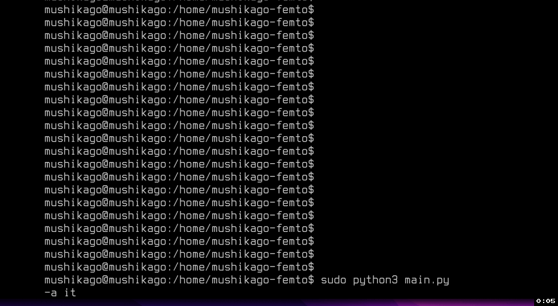

# **MUSHIKAGO-femto**


**MUSHIKAGO is an automated penetration testing and first aid tool, which focuses on the verification of post-exploitation.**


<p align="center">
<a href="https://twitter.com/TechKeg"></a>
</p>

---

## Features
- Full automatic penetration testing tool
- IT penetration testing
- OT/ICS penetration testing (Only device identify and protocol checking)
- First aid function (Automated patch or inject thin IPS)


## Abstract
  MUSHIKAGO-femto is a CLI (Command Line Interface) version of MUSHIKAGO. MUSHIKAGO uses game AI technology to select and execute the most appropriate test content based on the environment in spot. The application of game AI technology to security products is new, and our work has shown that game AI is most suitable for penetration testing, where the content needs to change depending on the environment. In addition, MUSHIKAGO can automatically perform penetration testing in mixed environments of IT and OT/ICS. This allows the user to perform penetration testing at a certain level without manual intervention. 


## Operation check environment:
- OS
  - Ubuntu Server 20.04 LTS
- Software
  - python3
  - nmap
  - metasploit
  - arp-scan
  - arp-scan-windows
  - tshark
- Python modules
  - pymetasploit3
  - mac-vendor-lookup
  - mechanicalsoup
  - msgpack


## How to install
#### Step.1 Git clone MUSHIKAGO-femto repository
```
$ git clone https://github.com/PowderKegTech/mushikago-femto
```

#### Step.2 Launch install script
```
$ sudo ./install.sh
```
It takes about 30 minites.

#### Step.3 Metasploit setup
```
$ msfconsole
```
And enter the appropriate response.

#### Step.4 Proxychains setup
```
edit /etc/proxychains.conf
```
add "socks4 127.0.0.1 1080" and comment out socks5 line.


## Usage
#### Step 0. Place the detection file in your Windows Desktop folder
- Detection file name should be mushikago\_secret.txt.
  - (Example of a placement folder) C:\Users\mushikago\Desktop
- Place mushikago\_secret.txt on the machine you want to eventually pwned.


#### Step 1-(a). MUSHIKAGO-femto execution (Target system is IT)
```
# python3 main.py -a it
```

#### Step 1-(b). MUSHIKAGO-femto execution (Target system is OT)
```
# python3 main.py -a ot
```

#### Step 1-(c). To specify an IP address (-ip or --ipaddr)
```
# python3 main.py -a it -ip x.x.x.x
```

#### Step 1-(d). To specify an NIC (-t or --type)
```
# python3 main.py -a it -ip x.x.x.x -t wlan0
```

#### Step 1-(e). Check help
```
# sudo python3 main.py -h
usage: main.py [-h] [-ip IPADDR] [-exc [EXCLUSION [EXCLUSION ...]]] [-t TYPE] [-a {it,ot}] [-ext EXECUTIONTIME] [-exp EXPLOIT]

optional arguments:
  -h, --help            show this help message and exit
  -ip IPADDR, --ipaddr IPADDR
                        Set the IP address.
  -exc [EXCLUSION [EXCLUSION ...]], --exclusion [EXCLUSION [EXCLUSION ...]]
                        Set exclusion IP addresses.
  -t TYPE, --type TYPE  Set the network interface type which eth0 or wlan0. The default is eth0. The eth0 is ethernet port on MUSHIKAGO. The wlan0 is wireless module
                        on MUSHIKAGO. Other virtual network devices (such as tun0) can also be selected.
  -a {it,ot}, --action {it,ot}
                        Set the action file. The default is it. The it is targeting to IT system. The ot is targeting to OT system.
  -ext EXECUTIONTIME, --executiontime EXECUTIONTIME
                        Set the execution time. At execution time, the pentest is terminated. Please specify in minutes.
  -exp EXPLOIT, --exploit EXPLOIT
                        Turn on the exploit fuction. If you do not want to affect the system in any way, we recommend turning it off.
```
Recommended to run as root.




#### Step 2. The log file is as follows
- nodes.json: List of detect devices

- mushikago.log: Execution details of MUSHIKAGO-femto

**Acknowledgement:** This code was created for personal use with hosts you able to hack/explore by any of the known bug bounty program. Use it at your own risk.


## Contents of Penetration testing
- Collecting device information (Only range of private ip address)
  - OS
  - NIC vendor
  - Open TCP/IP port
- Collecting User account detection
  - Local user account
  - Local user account password & hash
  - Domain user account
  - Domain user account password & hash
- Collecting OS patch & Vulnerabilities
- Collecting Network information
  - IP address information assigned to the NIC
  - Established network
- Collecting Network drive
- Capturing Network
- Collecting Secret file 
  - Pre-designated file (mushikago_secret.txt)
- Collecting Process list
- Collecting Security product process
  - AntiVurus Software
    - Panda
    - Kaspersky
    - Tanium
    - AVG/AVAST
    - SEP (Symantec Endpoint Protection)
    - Windows Defender
    - McAfee
    - Sophos
    - Malwarebytes
  - EDR (Endpoint Detection & Response)
    - Carbon Black
    - CrowdStrike
    - FireEye
    - ESET
    - F-Secure
- Lateral Movement (Mainly Windows only)
  - Exploiting vulnerability
  - Using credentials
- ICS detection
  - ICS Protocol identify
  - ICS vendor identify


## Achieved HTB (Hack The Box) machines
- Blue
- Legacy
- Optimum


## Future Works
- Add more exploit module
- Improving the game AI algorithm and add other AI algorithm

## Licence
- Apache License 2.0

## Developer
- [Powder Keg Technologies](https://www.powderkegtech.com/)
- https://twitter.com/TechKeg
- https://www.youtube.com/channel/UCcBHUaYYkqyW8fjbIjiY1ug

